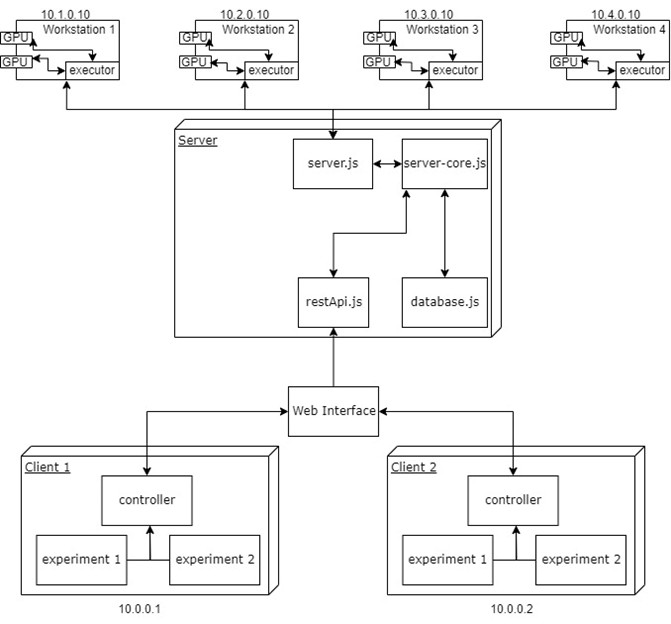

Maleci GPU Task Manager
=========

How to launch
--------------------

* If using Windows:
    * open project as wsl project in vscode;
    * install node inside wsl;
    * in wsl settings configure network mirroring (Nat -> Mirrored);
    * in Windows Firewall open port of this project's http-server;
    * in cmd run as admin: ```add_ports.bat``` to open ports 2601-2604
* in console run: ```npm install```
* in console run: ```sudo "$(which node)" server.js```
* in the same directory but in another console run:
    ```sudo "$(which node)" executor.js```

Architecture
-----------------


